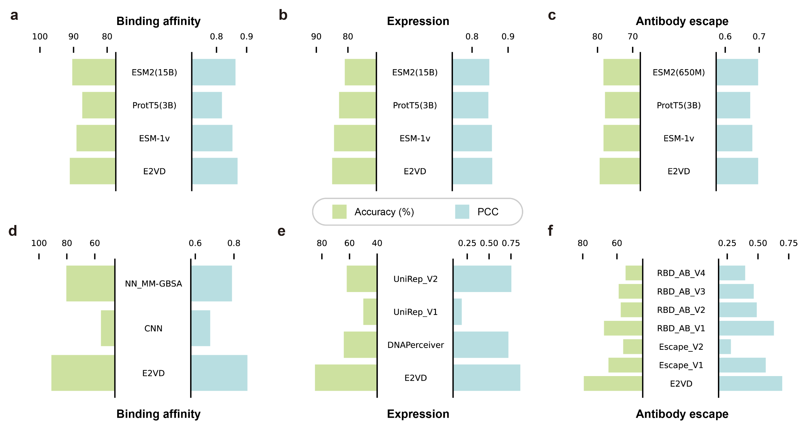

# E2VD

The official code repository of "E2VD: a unified evolution-driven framework for virus variation drivers prediction".

- [Overview](#overview)
- [System Requirements](#system-requirements)
- [Installation Guide](#installation-guide)
- [Repo contents](#repo-contents)
- [Demo and Instructions for Use](#demo-and-instructions-for-use)
- [License](#license)


# Overview

The increasing frequency of emerging viral infections necessitates a rapid human response, highlighting the cost-effectiveness of computational methods. 
However, existing computational approaches are limited by their input forms or incomplete functionalities, preventing a unified prediction of diverse viral variation drivers and hindering in-depth applications.
To address this issue, we propose a unified evolution-driven framework for predicting virus variation drivers, named E2VD, which is guided by virus evolutionary traits priors.
With evolution-inspired design, E2VD comprehensively and significantly outperforms state-of-the-art methods across various virus variation drivers prediction tasks.
Moreover, E2VD effectively captures the fundamental patterns of virus evolution. 
It not only distinguishes different types of mutations but also accurately identifies rare beneficial mutations that are critical for virus to survival, while maintains generalization capabilities on different viral lineages.
Importantly, with predicted biological drivers, E2VD perceives virus evolutionary trends, in which potential high-risk mutation sites are accurately recommended.
Overall, E2VD represents a unified, structure-free, and interpretable approach for analyzing and predicting viral evolutionary fitness, providing an ideal alternative to costly wet-lab measurements to accelerate responses to emerging viral infections.


# System Requirements

## Hardware requirements

The backbone pretraining and the protein feature extraction (inference on backbone) are conducted on **Ascend-910 (32GB)**.

**!! NOTE: The Ascend NPU environment is only for protein feature extraction. We provide the extracted features of the sequences used for experiments below. You can use the extracted results directly for downstream applications.**

The downstream predictions using extracted features can be conducted on a standard computer with NVIDIA GPU with no less than 8G memory and enough RAM to run training and inference. The downstream experiments are conducted on one Tesla V100 (32GB).

## Software requirements

### OS Requirements

The backbone pretraining and protein feature extraction (inference on backbone) are conducted on CentOS. **This is not necessary for downstream training and predicting.**

The downstream experiments are conducted on Ubuntu 16.04.1.

### Python Dependencies

For the backbone pretraining and protein feature extraction (inference on backbone), the required python environments are as follows.

**!! NOTE: This environment is only for protein feature extraction. We provide the extracted features of the sequences used for experiments below. You can use the extracted results directly for downstream applications.**

```
python==3.8
numpy>=1.21
mindspore==2.0.1
moxing
scipy
```

For the downstream experiments, the required python environments are as follows.

```
python==3.7.13
numpy>=1.21
torch==1.11.0
scikit-learn>=1.0.2
matplotlib>=3.5.1
transformers>=4.30.2
```

# Installation Guide

## Setting up downstream environment

Create a new environment.

```shell
conda create -n e2vd python=3.7
conda activate e2vd
```

Install pytorch 1.11.0.

```python
pip install torch==1.11.0+cu113 torchvision==0.12.0+cu113 torchaudio==0.11.0 --extra-index-url https://download.pytorch.org/whl/cu113
```

Install other dependencies.

```shell
pip install -r requirements.txt
```

It takes less than 10 minutes to install python dependencies for downstream experiments on a standard computer.


# Repo contents

```shell
- single_site_benchmark/ # experiments of single-site mutation sequences
	- bind/
		- baseline-CNN/
		- E2VD/
			- data_process/
				- customize/
				- ESM1v/
				- ESM2
				- T5/
			- *.py
	- expr/
		- baseline-DNAPerceiver/
		- baseline-UniRep/
		- E2VD/
			- customize/
			- ESM1v/
			- ESM2/
			- T5/
	- escape/
		- baseline-Escape/
		- baseline-RBD_AB/
		- E2VD/
			- customize/
			- ESM1v/
			- ESM2/
			- T5/
- LG_MT/ # ablation experiments of LG and MT module
	- bind_train_5fold*.py
	- bind_test_5fold.py
- PCA_visualization/ # PCA visualization of features before and after LG module
	- bind/
		- extract_feat_after_LG_bind.py
		- pca.py
	- expr/
	- escape/
- mine_rare_beneficial_mutation/ # ablation experiments on MT module
	- BCE_MSE/
		- bind_train_ablation.py
		- bind_test_ablation.py
	- MT/
		- bind_train.py
		- bind_test.py
	- get_data.py
- generalization_performance/ # generalization performance comparison of different models on binding affinity and expression
	- bind/
		- baseline-CNN/
			- _embedding_train/ # train model with single-site mutation benchmark
			- data_process/
			- model/
			- get_result.py # calculate OPP metrics
			- predict_RBD_emb_main.py # predict multi-site mutation sequences
		- E2VD/
	- expr/
		- baseline-DNAPerceiver/
			- _embedding_train/ # train model with single-site mutation benchmark
			- model/
			- get_result.py # calculate OPP metrics
			- predict_RBD_emb_main.py # predict multi-site mutation sequences
		- baseline-UniRep_ANN/
		- E2VD/
- perceive_evolutionary_trends/
	- calculate_ROC/
		- AUROC.py # calculate AUC and draw ROC
	- E2VD/
		- attributes_train_and_predict/
			- training/
				- bind_train/
				- expression_train/
				- escape_train/
			- predicting/
				- predict_bind_emb_main_pickle.py # use the pretrained model to predict binding affinity
				- predict_expr_emb_main_pickle.py # use the pretrained model to predict expression
				- predict_escape_emb_main_pickle.py # use the pretrained model to predict antibody escape
	- MLAEP/
		- src/
		- data/
		- draw_KL.py
		- get_seqs.py
- figure_reproduction/
	- mine_rare_beneficial_mutation/
	- MT_loss_ablation/
	- PCA_visualization/
	- perceive_evolutionary_trends/
- pretraining/ # codes for backbone pretraining and feature extracting
	- src/
		- bert_model.py # bert model architecture
		- bert_for_pre_training.py # bert pretraining architecture
		- dataset.py # dataset loader
		- ... # other src
		- model_utils/
			- device_adapter.py # adapter for distributed training
			- ... # other utils
	- run_pretrain.py # bert pretraining main
	- pretrain_config.yaml # training config
	- extract_embedding_local.py # feature extracting code for local device
- demo_bind/
	- bind_train_5fold.py # quick start for binding affinity training
	- bind_predict_5fold.py # quick start for binding affinity predicting
```


# Demo and Instructions for Use

## Quick start

We provide a quick demo for the binding affinity prediction experiment to show the learning and predicting ability of E2VD. The dataset used here is single-site mutation benchmark.

- Training

Download the extracted sequence feature of the training and testing data.

```shell
cd demo_bind/data
wget --no-check-certificate https://figshare.com/ndownloader/files/46588753 -O QuickStart.zip
unzip QuickStart.zip
cd ..
```

Run `bind_train_5fold.py` to do 5 fold cross validation using training data.

```shell
python bind_train_5fold.py > train_output.txt 2>&1
```

[](https://colab.research.google.com/github/ZhiweiNiepku/E2VD/blob/main/examples/E2VD_QuickStart_train.ipynb)

- Testing

Use training result to predict the binding affinity of the blind test set. Besides, we provide our training checkpoints to make a quick prediction. 

```shell
# run prediction
python bind_predict_5fold.py > test_result.txt 2>&1
```

[](https://colab.research.google.com/github/ZhiweiNiepku/E2VD/blob/main/examples/E2VD_QuickStart_predict.ipynb)

The expected outputs are as follows.

| AU-ROC   | Acc   | F1-Score | Precision | Recall | MSE   | Corr  |
| ----- | ----- | -------- | --------- | ------ | ----- | ----- |
| 92.98 | 91.11 | 91.58    | 87.43     | 96.30  | 0.058 | 0.870 |

It takes only several hours to train on training data, and several seconds to predict on test data.


## Quick demo for _in silico_ evolution

We provide a quick demo for the _in silico_ evolution on BA.5 lineage.
Please refer to `examples/E2VD_Evolution_demo.ipynb` for details, or open in Colab.

[](https://colab.research.google.com/github/ZhiweiNiepku/E2VD/blob/main/examples/E2VD_Evolution_demo.ipynb)

## Protein sequence feature extraction

**!! NOTE: We provide the extracted features of the sequences used for experiments at the end of this section. You can use the extracted results directly for downstream applications and skip this section.**

Use our pretrained backbone to extract feature embeddings of protein sequences for downstream application. The pretrained checkpoint can be downloaded in the table below.

Use `pretraining/extract_embedding_local.py` to extract feature embeddings on your computer or server. Please modify the file path in the code before executing.

```python
    ms.context.set_context(variable_memory_max_size="30GB")
    ckpt_path = '<path to the pretrained model>/checkpoint.ckpt'

    data_path = '<path to the dir to extract features>/raw/'
    filelist = glob.glob(data_path+"*.txt")
    filelist.sort()
    result_path = "<path to the dir to save results>/result/"
    os.makedirs(result_path, exist_ok=True)
```

We provide the extracted protein features as well as the pretrained checkpoints here for the convenient experiments on downstream tasks.


[![DOI](https://img.shields.io/badge/doi-10.6084/E2VD-blue.svg?style=flat&labelColor=gainsboro&logoWidth=40&logo=data%3Aimage%2Fpng%3Bbase64%2CiVBORw0KGgoAAAANSUhEUgAAAFAAAAAZCAYAAACmRqkJAAAKi0lEQVR4Ae3ZaVBUV97H8evuE0EfH32MmkcfoyAuGjXKgkvMaFRAFuiloemWvRuEXlgEBREXBYJiXAQUFeKocUniQiKogAJhQWwWENDEjLNYvjFLzUzNkplEZb5kTme6nCRjKlOpSZlb9SmL2%2Ffcuv3re87%2FnKP0TYfOcslqPMbt63xBKuh09MTxgi7HKT1Sj1TvKp%2BMkZB6%2FXT8c4AjUYPyVdfb7Qs6HTIJ8EHe7Ul%2B152CphDabRQ0uMr7%2FRQgh%2B8qU6%2FBiPDVGv0jq0uGE94b0ZZ3j%2B25MTetoMsh%2FWD91OBqT9%2Fsehd5EqGV17nKMzTqOHvaRMMLEp7qACfinq%2FW1BBx5ZxB13x5X3Jr1v%2Fz9pUcaHU63PiicjrhvXfNRbY1Th49Q6Y1vu6zyqSjzX3aVIgf4OkKToxhgxpd5OMzV0bYE4CRN1Chu34pnTfwnV03FiTlfzDRXBHo6dfgIq8sX6ByV6vjthGc0UdrrPPVGFQBxlSjzJQWENVUZkebceiLpyM8IZSx7O7Zl4JivUNMZX5h8Rt4%2B2L0llKfgu6JKa%2BXvpB5bZ48%2Ba3F6lil2pDkE2rODzCsU0VUnNFHNZQqdS3lx3Utl%2FMILQcfYt5TEeC1GSprgAq0XlgYGLQyxJTlr0uK0DVX7E5s2ZtOgHvLw5fLK9xVmcqguEj%2F2LXbwsvPBkZZKl4j5NcIKinaUsLbejFWZ7m8Do2cmwnb4cFqArRwx3TEYzi%2Bz7DTD0uhxnj8cAEWWUZK%2BTcdhh4pmTWUsW01Y1uCUmNY7Rtqzo5svJSS0poVXtg6yVj7sn9qunek3j8xPVXXeMFoaDkev6lDF7ene7Y5r2taNAXmEBXaP69zevaOjuUeeZ0zhzJuPsM5CdYvOhZVqBMhBqIVDt8zwGdQjR4of9AA%2BXJjUFpww7GodnHAQca4srDAWCXjW3pETal%2BbfumuOLKqSm17vIQtWr1Uu3JYy6JbXuXFbRN1R8pm5byxtG5CcdOz9EUVc7I5IeQEWQ7wWVwzwrsRn%2BbAFeiCxNsKv5Y9P03BFgjAlT90AGOQy2T47fObl00ocFZHl%2B2UGXw0RjzNUWHTPFthckHWh18al8KsGuaFigVVzlKuY%2BG9z37qvuoGlelpsJVldrgrFjbOE%2BeWe8uW18W84qCqc4s7tmCIgzI75hs%2FaJKNFu7rF%2BIIIhr%2BmIQ%2Btn8LQkDMQOeWAYnDHgsQI3NNU7W9j4h5t72o%2FEyvLEQ%2F%2Bu7ymzbOxbCAeOxAgtghz6YgOVYiufEOUlqu0M37ho%2BYn%2FnpJT8bsejVSt90uqdFdlGmV7hF7cuWXetNCShLX%2BI3nKhN%2ByvCs%2Bs6GQpWB33fzKNQR%2BqWr022yvc94q7spBCY%2Bbzkou6ZfJNPf89ZN%2FdidYHnIsKfIzjCMIc7MAwSJiMPFxGMcKQixGwx07R%2FiEe4CNsxFCbAJvwifj8LkIgYRHa8Lm47jNY8AokmMS5NryPh%2FijOB%2BOX4h7foEuyPHlisMtylJpzu1YspkQ36YbLqnx8F1X4abaqmYs9DGmLlrk4CE9XlHlKZskxfpt%2FUJLzyhV23dG%2BITF72fqo9njEaokwIu8lSbG1N4wx273CrP%2B%2BjniQVZhGrzQjlEioFIRcjDM6MIdjBVtHogvl4W9qIX8sTfwU5SgU%2FzdhdGYLcJ9BzvRID6vgx2SxN8PUI9KnIEWH4n7FuIo%2FoRfYV5vMMV4wHRFs%2BvG%2FKl05ZrDVdP11T7eulK3oNQcz%2FAXcj3DpMePjO44KetDL2lDh%2FmV1S3nNoeWnJb7RSXmMJl%2BI0GmH13rKs8lvEdQwfoWKmCxdmGbAEdgAW5jFiQhBb8WXSYTPSjGCBHaMPR5LMANkOCM%2B%2FgD3MS5Z8W1ElzwW3HNJCSI9tcw2ub%2BO8T5LPTBQBy1nusNcB7ztximI1sIsSSzXb04v3vyusJmx63nMufHXlV6LvpEShDd9x%2FHFYWXVPuSX7%2FD7zmpcjuWRupbyvaHnj8Z7BNsUFCArm70iTRcd5bFEN7oxwJs%2FpoA%2FwfBaLJ2Z2EFbmEsNKL7fYYPUI9DIqj%2Fsgkw0CasW%2BL6RbBDFI7gTZSKzz6Gk02AJ23G3QF4xybYU8INce6s5CJNlTyXhYwKv%2FRWMiEeimquzIhrPpGzuSNCsbvLec2%2Brpmh2e0yu%2FxOp96wv6p8X0xeIZW5Bo2%2F6ucdvb%2FdMWVDm8lX11pRpD16OJ6VyZsrQ8yK%2BVFJ9h4UhwEHDj5JgGE23UkSfoZujMMzSESNCPBT9KAFjqi2rcIYZRPgYmzDQ9xDLSz4%2FGsCPIE%2BNkWrTJy%2FhRrRthpVyJJExbnmG2I%2B6x%2BT%2FHxYyQkzQfJGlufpWy6bYlvPUEgu%2BHlHJA5boo7rE3blnBR7r6mv%2BvCBMYEag%2Faqsyr1%2BIk5a%2Fd2z9zGBDpZ31qulCWk9443Hfg5BuJJAgxAG0ZBEmS4DZ7RKIliMVi0d8UvRUCeuPoNAf4Z%2FmgV13pAwiwR3iffFKBQJM5noB%2F6Y5h45v7Wwf0cDtD1DlMIeiugWmZOy5Cv3RgjX7%2FF4GdMXasOjgurmqdafqpojltml9IjvOJ8NMu9lNL5gQmXdMu0BTefz8loMyoJvivs3VMZvhpjqaig%2FZ8gwJGYIsIKRh%2FY4wh%2Bg%2FGQoxYbREgZ%2BB3uww1V3xKgN%2BrwCNtF4Pvx8NveQCEYX%2BAukhCIYuHZLy%2FyDjHbJQfo7PTK1dEBWqPBX2vS%2B2hNW1XquDURypiwXStCjVWuyrSKQC%2FdoUaHtOT2HENoyal4b40x7rK7ylip9NIV3Jy0P6fD24fl3Ra6uoe3PNqOH2Pw3x%2FC8K8CHIU%2BIpQ7OI8yNOJ9TMJO%2FAU9Nn6PjRiGmm%2FpwgsRLQpKjwjuU%2Fz1CQK0R4G4T4%2FwCHWYKlmcA6xr4SA2EzobXeUa9vh21LgpdKxK8hqd5RsaXWS7S9YvlhU2O7ya3ekXrm%2B9lK3KzFH6a4y5V92Ve5hkM4d02EShMestZekE2IxZX7MWdkAgBtmsi9U2lXEwliAOK%2BGLTowThWIZkrEVSSKYgegPOUxwtFmdaBGLsRgg2qeKtosQDh2GYzbisUIEaPvcQ8T5VGzCKowBk2I3mTVALe4wd4tumKcoaZirSKte4RtVrvXwLrw%2BJXV%2F18Ts3BtLEmOaS0yRtRdMfpGJhTKNMbDJWR5V7eEbUNDtcIQAd1PJMwnuJl6E9KQHY7AAHkzQoBkj8B%2B%2FpTWQ4Maezne1P3x1esLBuqmB%2BbccNhJMGetbM%2BGZIi1V%2FoRyOXB77sKVWuPmrd4RBvYQm9ihVue%2F7xDPGljB50MoJmO%2By36gCGsQovCyCGwOarD9R7PLLXZOJjKZvse%2FDQQSvffG7F1rWrZPiLKUX2DPr1hbfHAKb0kDBSeTed5MQj94Pn1xBMvA%2B2IDYTAkcXzXANPRjHq04ACeFeH9aAIcBC3LOq%2FY5pPDeYtO4yRTmzUhbx9LozCEea8ybaHoxDNmVtPltxSVzxhCm3Asg4Tvs683Aa5wwkD8qP9XbgQqUbb6Tp09U5Os3rWiV4jZv2OuvxPdvht70RfST8fjATZd7P33OYzxZ%2FdF7FwcgqPU0yMR2vMYDulpDfBvw%2BGCdBePpq8AAAAASUVORK5CYII%3D)](https://figshare.com/projects/E2VD/206608)


| Section                                  | Download Link                                                | Content                                                      |
| ---------------------------------------- | ------------------------------------------------------------ | ------------------------------------------------------------ |
| **Pretrained checkpoint**                | [![DOI](https://img.shields.io/badge/doi-10.6084/ckpt-blue.svg?style=flat&labelColor=gainsboro&logoWidth=40&logo=data%3Aimage%2Fpng%3Bbase64%2CiVBORw0KGgoAAAANSUhEUgAAAFAAAAAZCAYAAACmRqkJAAAKi0lEQVR4Ae3ZaVBUV97H8evuE0EfH32MmkcfoyAuGjXKgkvMaFRAFuiloemWvRuEXlgEBREXBYJiXAQUFeKocUniQiKogAJhQWwWENDEjLNYvjFLzUzNkplEZb5kTme6nCRjKlOpSZlb9SmL2%2Ffcuv3re87%2FnKP0TYfOcslqPMbt63xBKuh09MTxgi7HKT1Sj1TvKp%2BMkZB6%2FXT8c4AjUYPyVdfb7Qs6HTIJ8EHe7Ul%2B152CphDabRQ0uMr7%2FRQgh%2B8qU6%2FBiPDVGv0jq0uGE94b0ZZ3j%2B25MTetoMsh%2FWD91OBqT9%2Fsehd5EqGV17nKMzTqOHvaRMMLEp7qACfinq%2FW1BBx5ZxB13x5X3Jr1v%2Fz9pUcaHU63PiicjrhvXfNRbY1Th49Q6Y1vu6zyqSjzX3aVIgf4OkKToxhgxpd5OMzV0bYE4CRN1Chu34pnTfwnV03FiTlfzDRXBHo6dfgIq8sX6ByV6vjthGc0UdrrPPVGFQBxlSjzJQWENVUZkebceiLpyM8IZSx7O7Zl4JivUNMZX5h8Rt4%2B2L0llKfgu6JKa%2BXvpB5bZ48%2Ba3F6lil2pDkE2rODzCsU0VUnNFHNZQqdS3lx3Utl%2FMILQcfYt5TEeC1GSprgAq0XlgYGLQyxJTlr0uK0DVX7E5s2ZtOgHvLw5fLK9xVmcqguEj%2F2LXbwsvPBkZZKl4j5NcIKinaUsLbejFWZ7m8Do2cmwnb4cFqArRwx3TEYzi%2Bz7DTD0uhxnj8cAEWWUZK%2BTcdhh4pmTWUsW01Y1uCUmNY7Rtqzo5svJSS0poVXtg6yVj7sn9qunek3j8xPVXXeMFoaDkev6lDF7ene7Y5r2taNAXmEBXaP69zevaOjuUeeZ0zhzJuPsM5CdYvOhZVqBMhBqIVDt8zwGdQjR4of9AA%2BXJjUFpww7GodnHAQca4srDAWCXjW3pETal%2BbfumuOLKqSm17vIQtWr1Uu3JYy6JbXuXFbRN1R8pm5byxtG5CcdOz9EUVc7I5IeQEWQ7wWVwzwrsRn%2BbAFeiCxNsKv5Y9P03BFgjAlT90AGOQy2T47fObl00ocFZHl%2B2UGXw0RjzNUWHTPFthckHWh18al8KsGuaFigVVzlKuY%2BG9z37qvuoGlelpsJVldrgrFjbOE%2BeWe8uW18W84qCqc4s7tmCIgzI75hs%2FaJKNFu7rF%2BIIIhr%2BmIQ%2Btn8LQkDMQOeWAYnDHgsQI3NNU7W9j4h5t72o%2FEyvLEQ%2F%2Bu7ymzbOxbCAeOxAgtghz6YgOVYiufEOUlqu0M37ho%2BYn%2FnpJT8bsejVSt90uqdFdlGmV7hF7cuWXetNCShLX%2BI3nKhN%2ByvCs%2Bs6GQpWB33fzKNQR%2BqWr022yvc94q7spBCY%2Bbzkou6ZfJNPf89ZN%2FdidYHnIsKfIzjCMIc7MAwSJiMPFxGMcKQixGwx07R%2FiEe4CNsxFCbAJvwifj8LkIgYRHa8Lm47jNY8AokmMS5NryPh%2FijOB%2BOX4h7foEuyPHlisMtylJpzu1YspkQ36YbLqnx8F1X4abaqmYs9DGmLlrk4CE9XlHlKZskxfpt%2FUJLzyhV23dG%2BITF72fqo9njEaokwIu8lSbG1N4wx273CrP%2B%2BjniQVZhGrzQjlEioFIRcjDM6MIdjBVtHogvl4W9qIX8sTfwU5SgU%2FzdhdGYLcJ9BzvRID6vgx2SxN8PUI9KnIEWH4n7FuIo%2FoRfYV5vMMV4wHRFs%2BvG%2FKl05ZrDVdP11T7eulK3oNQcz%2FAXcj3DpMePjO44KetDL2lDh%2FmV1S3nNoeWnJb7RSXmMJl%2BI0GmH13rKs8lvEdQwfoWKmCxdmGbAEdgAW5jFiQhBb8WXSYTPSjGCBHaMPR5LMANkOCM%2B%2FgD3MS5Z8W1ElzwW3HNJCSI9tcw2ub%2BO8T5LPTBQBy1nusNcB7ztximI1sIsSSzXb04v3vyusJmx63nMufHXlV6LvpEShDd9x%2FHFYWXVPuSX7%2FD7zmpcjuWRupbyvaHnj8Z7BNsUFCArm70iTRcd5bFEN7oxwJs%2FpoA%2FwfBaLJ2Z2EFbmEsNKL7fYYPUI9DIqj%2Fsgkw0CasW%2BL6RbBDFI7gTZSKzz6Gk02AJ23G3QF4xybYU8INce6s5CJNlTyXhYwKv%2FRWMiEeimquzIhrPpGzuSNCsbvLec2%2Brpmh2e0yu%2FxOp96wv6p8X0xeIZW5Bo2%2F6ucdvb%2FdMWVDm8lX11pRpD16OJ6VyZsrQ8yK%2BVFJ9h4UhwEHDj5JgGE23UkSfoZujMMzSESNCPBT9KAFjqi2rcIYZRPgYmzDQ9xDLSz4%2FGsCPIE%2BNkWrTJy%2FhRrRthpVyJJExbnmG2I%2B6x%2BT%2FHxYyQkzQfJGlufpWy6bYlvPUEgu%2BHlHJA5boo7rE3blnBR7r6mv%2BvCBMYEag%2Faqsyr1%2BIk5a%2Fd2z9zGBDpZ31qulCWk9443Hfg5BuJJAgxAG0ZBEmS4DZ7RKIliMVi0d8UvRUCeuPoNAf4Z%2FmgV13pAwiwR3iffFKBQJM5noB%2F6Y5h45v7Wwf0cDtD1DlMIeiugWmZOy5Cv3RgjX7%2FF4GdMXasOjgurmqdafqpojltml9IjvOJ8NMu9lNL5gQmXdMu0BTefz8loMyoJvivs3VMZvhpjqaig%2FZ8gwJGYIsIKRh%2FY4wh%2Bg%2FGQoxYbREgZ%2BB3uww1V3xKgN%2BrwCNtF4Pvx8NveQCEYX%2BAukhCIYuHZLy%2FyDjHbJQfo7PTK1dEBWqPBX2vS%2B2hNW1XquDURypiwXStCjVWuyrSKQC%2FdoUaHtOT2HENoyal4b40x7rK7ylip9NIV3Jy0P6fD24fl3Ra6uoe3PNqOH2Pw3x%2FC8K8CHIU%2BIpQ7OI8yNOJ9TMJO%2FAU9Nn6PjRiGmm%2FpwgsRLQpKjwjuU%2Fz1CQK0R4G4T4%2FwCHWYKlmcA6xr4SA2EzobXeUa9vh21LgpdKxK8hqd5RsaXWS7S9YvlhU2O7ya3ekXrm%2B9lK3KzFH6a4y5V92Ve5hkM4d02EShMestZekE2IxZX7MWdkAgBtmsi9U2lXEwliAOK%2BGLTowThWIZkrEVSSKYgegPOUxwtFmdaBGLsRgg2qeKtosQDh2GYzbisUIEaPvcQ8T5VGzCKowBk2I3mTVALe4wd4tumKcoaZirSKte4RtVrvXwLrw%2BJXV%2F18Ts3BtLEmOaS0yRtRdMfpGJhTKNMbDJWR5V7eEbUNDtcIQAd1PJMwnuJl6E9KQHY7AAHkzQoBkj8B%2B%2FpTWQ4Maezne1P3x1esLBuqmB%2BbccNhJMGetbM%2BGZIi1V%2FoRyOXB77sKVWuPmrd4RBvYQm9ihVue%2F7xDPGljB50MoJmO%2By36gCGsQovCyCGwOarD9R7PLLXZOJjKZvse%2FDQQSvffG7F1rWrZPiLKUX2DPr1hbfHAKb0kDBSeTed5MQj94Pn1xBMvA%2B2IDYTAkcXzXANPRjHq04ACeFeH9aAIcBC3LOq%2FY5pPDeYtO4yRTmzUhbx9LozCEea8ybaHoxDNmVtPltxSVzxhCm3Asg4Tvs683Aa5wwkD8qP9XbgQqUbb6Tp09U5Os3rWiV4jZv2OuvxPdvht70RfST8fjATZd7P33OYzxZ%2FdF7FwcgqPU0yMR2vMYDulpDfBvw%2BGCdBePpq8AAAAASUVORK5CYII%3D)](https://doi.org/10.6084/m9.figshare.25932394) | Pretrained checkpoint for our customized protein language model.     |
| **QuickStart**                           | [![DOI](https://img.shields.io/badge/doi-10.6084/Quick-blue.svg?style=flat&labelColor=gainsboro&logoWidth=40&logo=data%3Aimage%2Fpng%3Bbase64%2CiVBORw0KGgoAAAANSUhEUgAAAFAAAAAZCAYAAACmRqkJAAAKi0lEQVR4Ae3ZaVBUV97H8evuE0EfH32MmkcfoyAuGjXKgkvMaFRAFuiloemWvRuEXlgEBREXBYJiXAQUFeKocUniQiKogAJhQWwWENDEjLNYvjFLzUzNkplEZb5kTme6nCRjKlOpSZlb9SmL2%2Ffcuv3re87%2FnKP0TYfOcslqPMbt63xBKuh09MTxgi7HKT1Sj1TvKp%2BMkZB6%2FXT8c4AjUYPyVdfb7Qs6HTIJ8EHe7Ul%2B152CphDabRQ0uMr7%2FRQgh%2B8qU6%2FBiPDVGv0jq0uGE94b0ZZ3j%2B25MTetoMsh%2FWD91OBqT9%2Fsehd5EqGV17nKMzTqOHvaRMMLEp7qACfinq%2FW1BBx5ZxB13x5X3Jr1v%2Fz9pUcaHU63PiicjrhvXfNRbY1Th49Q6Y1vu6zyqSjzX3aVIgf4OkKToxhgxpd5OMzV0bYE4CRN1Chu34pnTfwnV03FiTlfzDRXBHo6dfgIq8sX6ByV6vjthGc0UdrrPPVGFQBxlSjzJQWENVUZkebceiLpyM8IZSx7O7Zl4JivUNMZX5h8Rt4%2B2L0llKfgu6JKa%2BXvpB5bZ48%2Ba3F6lil2pDkE2rODzCsU0VUnNFHNZQqdS3lx3Utl%2FMILQcfYt5TEeC1GSprgAq0XlgYGLQyxJTlr0uK0DVX7E5s2ZtOgHvLw5fLK9xVmcqguEj%2F2LXbwsvPBkZZKl4j5NcIKinaUsLbejFWZ7m8Do2cmwnb4cFqArRwx3TEYzi%2Bz7DTD0uhxnj8cAEWWUZK%2BTcdhh4pmTWUsW01Y1uCUmNY7Rtqzo5svJSS0poVXtg6yVj7sn9qunek3j8xPVXXeMFoaDkev6lDF7ene7Y5r2taNAXmEBXaP69zevaOjuUeeZ0zhzJuPsM5CdYvOhZVqBMhBqIVDt8zwGdQjR4of9AA%2BXJjUFpww7GodnHAQca4srDAWCXjW3pETal%2BbfumuOLKqSm17vIQtWr1Uu3JYy6JbXuXFbRN1R8pm5byxtG5CcdOz9EUVc7I5IeQEWQ7wWVwzwrsRn%2BbAFeiCxNsKv5Y9P03BFgjAlT90AGOQy2T47fObl00ocFZHl%2B2UGXw0RjzNUWHTPFthckHWh18al8KsGuaFigVVzlKuY%2BG9z37qvuoGlelpsJVldrgrFjbOE%2BeWe8uW18W84qCqc4s7tmCIgzI75hs%2FaJKNFu7rF%2BIIIhr%2BmIQ%2Btn8LQkDMQOeWAYnDHgsQI3NNU7W9j4h5t72o%2FEyvLEQ%2F%2Bu7ymzbOxbCAeOxAgtghz6YgOVYiufEOUlqu0M37ho%2BYn%2FnpJT8bsejVSt90uqdFdlGmV7hF7cuWXetNCShLX%2BI3nKhN%2ByvCs%2Bs6GQpWB33fzKNQR%2BqWr022yvc94q7spBCY%2Bbzkou6ZfJNPf89ZN%2FdidYHnIsKfIzjCMIc7MAwSJiMPFxGMcKQixGwx07R%2FiEe4CNsxFCbAJvwifj8LkIgYRHa8Lm47jNY8AokmMS5NryPh%2FijOB%2BOX4h7foEuyPHlisMtylJpzu1YspkQ36YbLqnx8F1X4abaqmYs9DGmLlrk4CE9XlHlKZskxfpt%2FUJLzyhV23dG%2BITF72fqo9njEaokwIu8lSbG1N4wx273CrP%2B%2BjniQVZhGrzQjlEioFIRcjDM6MIdjBVtHogvl4W9qIX8sTfwU5SgU%2FzdhdGYLcJ9BzvRID6vgx2SxN8PUI9KnIEWH4n7FuIo%2FoRfYV5vMMV4wHRFs%2BvG%2FKl05ZrDVdP11T7eulK3oNQcz%2FAXcj3DpMePjO44KetDL2lDh%2FmV1S3nNoeWnJb7RSXmMJl%2BI0GmH13rKs8lvEdQwfoWKmCxdmGbAEdgAW5jFiQhBb8WXSYTPSjGCBHaMPR5LMANkOCM%2B%2FgD3MS5Z8W1ElzwW3HNJCSI9tcw2ub%2BO8T5LPTBQBy1nusNcB7ztximI1sIsSSzXb04v3vyusJmx63nMufHXlV6LvpEShDd9x%2FHFYWXVPuSX7%2FD7zmpcjuWRupbyvaHnj8Z7BNsUFCArm70iTRcd5bFEN7oxwJs%2FpoA%2FwfBaLJ2Z2EFbmEsNKL7fYYPUI9DIqj%2Fsgkw0CasW%2BL6RbBDFI7gTZSKzz6Gk02AJ23G3QF4xybYU8INce6s5CJNlTyXhYwKv%2FRWMiEeimquzIhrPpGzuSNCsbvLec2%2Brpmh2e0yu%2FxOp96wv6p8X0xeIZW5Bo2%2F6ucdvb%2FdMWVDm8lX11pRpD16OJ6VyZsrQ8yK%2BVFJ9h4UhwEHDj5JgGE23UkSfoZujMMzSESNCPBT9KAFjqi2rcIYZRPgYmzDQ9xDLSz4%2FGsCPIE%2BNkWrTJy%2FhRrRthpVyJJExbnmG2I%2B6x%2BT%2FHxYyQkzQfJGlufpWy6bYlvPUEgu%2BHlHJA5boo7rE3blnBR7r6mv%2BvCBMYEag%2Faqsyr1%2BIk5a%2Fd2z9zGBDpZ31qulCWk9443Hfg5BuJJAgxAG0ZBEmS4DZ7RKIliMVi0d8UvRUCeuPoNAf4Z%2FmgV13pAwiwR3iffFKBQJM5noB%2F6Y5h45v7Wwf0cDtD1DlMIeiugWmZOy5Cv3RgjX7%2FF4GdMXasOjgurmqdafqpojltml9IjvOJ8NMu9lNL5gQmXdMu0BTefz8loMyoJvivs3VMZvhpjqaig%2FZ8gwJGYIsIKRh%2FY4wh%2Bg%2FGQoxYbREgZ%2BB3uww1V3xKgN%2BrwCNtF4Pvx8NveQCEYX%2BAukhCIYuHZLy%2FyDjHbJQfo7PTK1dEBWqPBX2vS%2B2hNW1XquDURypiwXStCjVWuyrSKQC%2FdoUaHtOT2HENoyal4b40x7rK7ylip9NIV3Jy0P6fD24fl3Ra6uoe3PNqOH2Pw3x%2FC8K8CHIU%2BIpQ7OI8yNOJ9TMJO%2FAU9Nn6PjRiGmm%2FpwgsRLQpKjwjuU%2Fz1CQK0R4G4T4%2FwCHWYKlmcA6xr4SA2EzobXeUa9vh21LgpdKxK8hqd5RsaXWS7S9YvlhU2O7ya3ekXrm%2B9lK3KzFH6a4y5V92Ve5hkM4d02EShMestZekE2IxZX7MWdkAgBtmsi9U2lXEwliAOK%2BGLTowThWIZkrEVSSKYgegPOUxwtFmdaBGLsRgg2qeKtosQDh2GYzbisUIEaPvcQ8T5VGzCKowBk2I3mTVALe4wd4tumKcoaZirSKte4RtVrvXwLrw%2BJXV%2F18Ts3BtLEmOaS0yRtRdMfpGJhTKNMbDJWR5V7eEbUNDtcIQAd1PJMwnuJl6E9KQHY7AAHkzQoBkj8B%2B%2FpTWQ4Maezne1P3x1esLBuqmB%2BbccNhJMGetbM%2BGZIi1V%2FoRyOXB77sKVWuPmrd4RBvYQm9ihVue%2F7xDPGljB50MoJmO%2By36gCGsQovCyCGwOarD9R7PLLXZOJjKZvse%2FDQQSvffG7F1rWrZPiLKUX2DPr1hbfHAKb0kDBSeTed5MQj94Pn1xBMvA%2B2IDYTAkcXzXANPRjHq04ACeFeH9aAIcBC3LOq%2FY5pPDeYtO4yRTmzUhbx9LozCEea8ybaHoxDNmVtPltxSVzxhCm3Asg4Tvs683Aa5wwkD8qP9XbgQqUbb6Tp09U5Os3rWiV4jZv2OuvxPdvht70RfST8fjATZd7P33OYzxZ%2FdF7FwcgqPU0yMR2vMYDulpDfBvw%2BGCdBePpq8AAAAASUVORK5CYII%3D)](https://doi.org/10.6084/m9.figshare.25911490.v1) | Extracted features and trained checkpoints.                  |
| **Single site benchmark**       | [![DOI](https://img.shields.io/badge/doi-10.6084/Single-blue.svg?style=flat&labelColor=gainsboro&logoWidth=40&logo=data%3Aimage%2Fpng%3Bbase64%2CiVBORw0KGgoAAAANSUhEUgAAAFAAAAAZCAYAAACmRqkJAAAKi0lEQVR4Ae3ZaVBUV97H8evuE0EfH32MmkcfoyAuGjXKgkvMaFRAFuiloemWvRuEXlgEBREXBYJiXAQUFeKocUniQiKogAJhQWwWENDEjLNYvjFLzUzNkplEZb5kTme6nCRjKlOpSZlb9SmL2%2Ffcuv3re87%2FnKP0TYfOcslqPMbt63xBKuh09MTxgi7HKT1Sj1TvKp%2BMkZB6%2FXT8c4AjUYPyVdfb7Qs6HTIJ8EHe7Ul%2B152CphDabRQ0uMr7%2FRQgh%2B8qU6%2FBiPDVGv0jq0uGE94b0ZZ3j%2B25MTetoMsh%2FWD91OBqT9%2Fsehd5EqGV17nKMzTqOHvaRMMLEp7qACfinq%2FW1BBx5ZxB13x5X3Jr1v%2Fz9pUcaHU63PiicjrhvXfNRbY1Th49Q6Y1vu6zyqSjzX3aVIgf4OkKToxhgxpd5OMzV0bYE4CRN1Chu34pnTfwnV03FiTlfzDRXBHo6dfgIq8sX6ByV6vjthGc0UdrrPPVGFQBxlSjzJQWENVUZkebceiLpyM8IZSx7O7Zl4JivUNMZX5h8Rt4%2B2L0llKfgu6JKa%2BXvpB5bZ48%2Ba3F6lil2pDkE2rODzCsU0VUnNFHNZQqdS3lx3Utl%2FMILQcfYt5TEeC1GSprgAq0XlgYGLQyxJTlr0uK0DVX7E5s2ZtOgHvLw5fLK9xVmcqguEj%2F2LXbwsvPBkZZKl4j5NcIKinaUsLbejFWZ7m8Do2cmwnb4cFqArRwx3TEYzi%2Bz7DTD0uhxnj8cAEWWUZK%2BTcdhh4pmTWUsW01Y1uCUmNY7Rtqzo5svJSS0poVXtg6yVj7sn9qunek3j8xPVXXeMFoaDkev6lDF7ene7Y5r2taNAXmEBXaP69zevaOjuUeeZ0zhzJuPsM5CdYvOhZVqBMhBqIVDt8zwGdQjR4of9AA%2BXJjUFpww7GodnHAQca4srDAWCXjW3pETal%2BbfumuOLKqSm17vIQtWr1Uu3JYy6JbXuXFbRN1R8pm5byxtG5CcdOz9EUVc7I5IeQEWQ7wWVwzwrsRn%2BbAFeiCxNsKv5Y9P03BFgjAlT90AGOQy2T47fObl00ocFZHl%2B2UGXw0RjzNUWHTPFthckHWh18al8KsGuaFigVVzlKuY%2BG9z37qvuoGlelpsJVldrgrFjbOE%2BeWe8uW18W84qCqc4s7tmCIgzI75hs%2FaJKNFu7rF%2BIIIhr%2BmIQ%2Btn8LQkDMQOeWAYnDHgsQI3NNU7W9j4h5t72o%2FEyvLEQ%2F%2Bu7ymzbOxbCAeOxAgtghz6YgOVYiufEOUlqu0M37ho%2BYn%2FnpJT8bsejVSt90uqdFdlGmV7hF7cuWXetNCShLX%2BI3nKhN%2ByvCs%2Bs6GQpWB33fzKNQR%2BqWr022yvc94q7spBCY%2Bbzkou6ZfJNPf89ZN%2FdidYHnIsKfIzjCMIc7MAwSJiMPFxGMcKQixGwx07R%2FiEe4CNsxFCbAJvwifj8LkIgYRHa8Lm47jNY8AokmMS5NryPh%2FijOB%2BOX4h7foEuyPHlisMtylJpzu1YspkQ36YbLqnx8F1X4abaqmYs9DGmLlrk4CE9XlHlKZskxfpt%2FUJLzyhV23dG%2BITF72fqo9njEaokwIu8lSbG1N4wx273CrP%2B%2BjniQVZhGrzQjlEioFIRcjDM6MIdjBVtHogvl4W9qIX8sTfwU5SgU%2FzdhdGYLcJ9BzvRID6vgx2SxN8PUI9KnIEWH4n7FuIo%2FoRfYV5vMMV4wHRFs%2BvG%2FKl05ZrDVdP11T7eulK3oNQcz%2FAXcj3DpMePjO44KetDL2lDh%2FmV1S3nNoeWnJb7RSXmMJl%2BI0GmH13rKs8lvEdQwfoWKmCxdmGbAEdgAW5jFiQhBb8WXSYTPSjGCBHaMPR5LMANkOCM%2B%2FgD3MS5Z8W1ElzwW3HNJCSI9tcw2ub%2BO8T5LPTBQBy1nusNcB7ztximI1sIsSSzXb04v3vyusJmx63nMufHXlV6LvpEShDd9x%2FHFYWXVPuSX7%2FD7zmpcjuWRupbyvaHnj8Z7BNsUFCArm70iTRcd5bFEN7oxwJs%2FpoA%2FwfBaLJ2Z2EFbmEsNKL7fYYPUI9DIqj%2Fsgkw0CasW%2BL6RbBDFI7gTZSKzz6Gk02AJ23G3QF4xybYU8INce6s5CJNlTyXhYwKv%2FRWMiEeimquzIhrPpGzuSNCsbvLec2%2Brpmh2e0yu%2FxOp96wv6p8X0xeIZW5Bo2%2F6ucdvb%2FdMWVDm8lX11pRpD16OJ6VyZsrQ8yK%2BVFJ9h4UhwEHDj5JgGE23UkSfoZujMMzSESNCPBT9KAFjqi2rcIYZRPgYmzDQ9xDLSz4%2FGsCPIE%2BNkWrTJy%2FhRrRthpVyJJExbnmG2I%2B6x%2BT%2FHxYyQkzQfJGlufpWy6bYlvPUEgu%2BHlHJA5boo7rE3blnBR7r6mv%2BvCBMYEag%2Faqsyr1%2BIk5a%2Fd2z9zGBDpZ31qulCWk9443Hfg5BuJJAgxAG0ZBEmS4DZ7RKIliMVi0d8UvRUCeuPoNAf4Z%2FmgV13pAwiwR3iffFKBQJM5noB%2F6Y5h45v7Wwf0cDtD1DlMIeiugWmZOy5Cv3RgjX7%2FF4GdMXasOjgurmqdafqpojltml9IjvOJ8NMu9lNL5gQmXdMu0BTefz8loMyoJvivs3VMZvhpjqaig%2FZ8gwJGYIsIKRh%2FY4wh%2Bg%2FGQoxYbREgZ%2BB3uww1V3xKgN%2BrwCNtF4Pvx8NveQCEYX%2BAukhCIYuHZLy%2FyDjHbJQfo7PTK1dEBWqPBX2vS%2B2hNW1XquDURypiwXStCjVWuyrSKQC%2FdoUaHtOT2HENoyal4b40x7rK7ylip9NIV3Jy0P6fD24fl3Ra6uoe3PNqOH2Pw3x%2FC8K8CHIU%2BIpQ7OI8yNOJ9TMJO%2FAU9Nn6PjRiGmm%2FpwgsRLQpKjwjuU%2Fz1CQK0R4G4T4%2FwCHWYKlmcA6xr4SA2EzobXeUa9vh21LgpdKxK8hqd5RsaXWS7S9YvlhU2O7ya3ekXrm%2B9lK3KzFH6a4y5V92Ve5hkM4d02EShMestZekE2IxZX7MWdkAgBtmsi9U2lXEwliAOK%2BGLTowThWIZkrEVSSKYgegPOUxwtFmdaBGLsRgg2qeKtosQDh2GYzbisUIEaPvcQ8T5VGzCKowBk2I3mTVALe4wd4tumKcoaZirSKte4RtVrvXwLrw%2BJXV%2F18Ts3BtLEmOaS0yRtRdMfpGJhTKNMbDJWR5V7eEbUNDtcIQAd1PJMwnuJl6E9KQHY7AAHkzQoBkj8B%2B%2FpTWQ4Maezne1P3x1esLBuqmB%2BbccNhJMGetbM%2BGZIi1V%2FoRyOXB77sKVWuPmrd4RBvYQm9ihVue%2F7xDPGljB50MoJmO%2By36gCGsQovCyCGwOarD9R7PLLXZOJjKZvse%2FDQQSvffG7F1rWrZPiLKUX2DPr1hbfHAKb0kDBSeTed5MQj94Pn1xBMvA%2B2IDYTAkcXzXANPRjHq04ACeFeH9aAIcBC3LOq%2FY5pPDeYtO4yRTmzUhbx9LozCEea8ybaHoxDNmVtPltxSVzxhCm3Asg4Tvs683Aa5wwkD8qP9XbgQqUbb6Tp09U5Os3rWiV4jZv2OuvxPdvht70RfST8fjATZd7P33OYzxZ%2FdF7FwcgqPU0yMR2vMYDulpDfBvw%2BGCdBePpq8AAAAASUVORK5CYII%3D)](https://doi.org/10.6084/m9.figshare.25919362) | The single-site mutation benchmark, including extracted features of RBD and antibody sequences.                    |
| **Mine rare beneficial mutation**       | [![DOI](https://img.shields.io/badge/doi-10.6084/Mine-blue.svg?style=flat&labelColor=gainsboro&logoWidth=40&logo=data%3Aimage%2Fpng%3Bbase64%2CiVBORw0KGgoAAAANSUhEUgAAAFAAAAAZCAYAAACmRqkJAAAKi0lEQVR4Ae3ZaVBUV97H8evuE0EfH32MmkcfoyAuGjXKgkvMaFRAFuiloemWvRuEXlgEBREXBYJiXAQUFeKocUniQiKogAJhQWwWENDEjLNYvjFLzUzNkplEZb5kTme6nCRjKlOpSZlb9SmL2%2Ffcuv3re87%2FnKP0TYfOcslqPMbt63xBKuh09MTxgi7HKT1Sj1TvKp%2BMkZB6%2FXT8c4AjUYPyVdfb7Qs6HTIJ8EHe7Ul%2B152CphDabRQ0uMr7%2FRQgh%2B8qU6%2FBiPDVGv0jq0uGE94b0ZZ3j%2B25MTetoMsh%2FWD91OBqT9%2Fsehd5EqGV17nKMzTqOHvaRMMLEp7qACfinq%2FW1BBx5ZxB13x5X3Jr1v%2Fz9pUcaHU63PiicjrhvXfNRbY1Th49Q6Y1vu6zyqSjzX3aVIgf4OkKToxhgxpd5OMzV0bYE4CRN1Chu34pnTfwnV03FiTlfzDRXBHo6dfgIq8sX6ByV6vjthGc0UdrrPPVGFQBxlSjzJQWENVUZkebceiLpyM8IZSx7O7Zl4JivUNMZX5h8Rt4%2B2L0llKfgu6JKa%2BXvpB5bZ48%2Ba3F6lil2pDkE2rODzCsU0VUnNFHNZQqdS3lx3Utl%2FMILQcfYt5TEeC1GSprgAq0XlgYGLQyxJTlr0uK0DVX7E5s2ZtOgHvLw5fLK9xVmcqguEj%2F2LXbwsvPBkZZKl4j5NcIKinaUsLbejFWZ7m8Do2cmwnb4cFqArRwx3TEYzi%2Bz7DTD0uhxnj8cAEWWUZK%2BTcdhh4pmTWUsW01Y1uCUmNY7Rtqzo5svJSS0poVXtg6yVj7sn9qunek3j8xPVXXeMFoaDkev6lDF7ene7Y5r2taNAXmEBXaP69zevaOjuUeeZ0zhzJuPsM5CdYvOhZVqBMhBqIVDt8zwGdQjR4of9AA%2BXJjUFpww7GodnHAQca4srDAWCXjW3pETal%2BbfumuOLKqSm17vIQtWr1Uu3JYy6JbXuXFbRN1R8pm5byxtG5CcdOz9EUVc7I5IeQEWQ7wWVwzwrsRn%2BbAFeiCxNsKv5Y9P03BFgjAlT90AGOQy2T47fObl00ocFZHl%2B2UGXw0RjzNUWHTPFthckHWh18al8KsGuaFigVVzlKuY%2BG9z37qvuoGlelpsJVldrgrFjbOE%2BeWe8uW18W84qCqc4s7tmCIgzI75hs%2FaJKNFu7rF%2BIIIhr%2BmIQ%2Btn8LQkDMQOeWAYnDHgsQI3NNU7W9j4h5t72o%2FEyvLEQ%2F%2Bu7ymzbOxbCAeOxAgtghz6YgOVYiufEOUlqu0M37ho%2BYn%2FnpJT8bsejVSt90uqdFdlGmV7hF7cuWXetNCShLX%2BI3nKhN%2ByvCs%2Bs6GQpWB33fzKNQR%2BqWr022yvc94q7spBCY%2Bbzkou6ZfJNPf89ZN%2FdidYHnIsKfIzjCMIc7MAwSJiMPFxGMcKQixGwx07R%2FiEe4CNsxFCbAJvwifj8LkIgYRHa8Lm47jNY8AokmMS5NryPh%2FijOB%2BOX4h7foEuyPHlisMtylJpzu1YspkQ36YbLqnx8F1X4abaqmYs9DGmLlrk4CE9XlHlKZskxfpt%2FUJLzyhV23dG%2BITF72fqo9njEaokwIu8lSbG1N4wx273CrP%2B%2BjniQVZhGrzQjlEioFIRcjDM6MIdjBVtHogvl4W9qIX8sTfwU5SgU%2FzdhdGYLcJ9BzvRID6vgx2SxN8PUI9KnIEWH4n7FuIo%2FoRfYV5vMMV4wHRFs%2BvG%2FKl05ZrDVdP11T7eulK3oNQcz%2FAXcj3DpMePjO44KetDL2lDh%2FmV1S3nNoeWnJb7RSXmMJl%2BI0GmH13rKs8lvEdQwfoWKmCxdmGbAEdgAW5jFiQhBb8WXSYTPSjGCBHaMPR5LMANkOCM%2B%2FgD3MS5Z8W1ElzwW3HNJCSI9tcw2ub%2BO8T5LPTBQBy1nusNcB7ztximI1sIsSSzXb04v3vyusJmx63nMufHXlV6LvpEShDd9x%2FHFYWXVPuSX7%2FD7zmpcjuWRupbyvaHnj8Z7BNsUFCArm70iTRcd5bFEN7oxwJs%2FpoA%2FwfBaLJ2Z2EFbmEsNKL7fYYPUI9DIqj%2Fsgkw0CasW%2BL6RbBDFI7gTZSKzz6Gk02AJ23G3QF4xybYU8INce6s5CJNlTyXhYwKv%2FRWMiEeimquzIhrPpGzuSNCsbvLec2%2Brpmh2e0yu%2FxOp96wv6p8X0xeIZW5Bo2%2F6ucdvb%2FdMWVDm8lX11pRpD16OJ6VyZsrQ8yK%2BVFJ9h4UhwEHDj5JgGE23UkSfoZujMMzSESNCPBT9KAFjqi2rcIYZRPgYmzDQ9xDLSz4%2FGsCPIE%2BNkWrTJy%2FhRrRthpVyJJExbnmG2I%2B6x%2BT%2FHxYyQkzQfJGlufpWy6bYlvPUEgu%2BHlHJA5boo7rE3blnBR7r6mv%2BvCBMYEag%2Faqsyr1%2BIk5a%2Fd2z9zGBDpZ31qulCWk9443Hfg5BuJJAgxAG0ZBEmS4DZ7RKIliMVi0d8UvRUCeuPoNAf4Z%2FmgV13pAwiwR3iffFKBQJM5noB%2F6Y5h45v7Wwf0cDtD1DlMIeiugWmZOy5Cv3RgjX7%2FF4GdMXasOjgurmqdafqpojltml9IjvOJ8NMu9lNL5gQmXdMu0BTefz8loMyoJvivs3VMZvhpjqaig%2FZ8gwJGYIsIKRh%2FY4wh%2Bg%2FGQoxYbREgZ%2BB3uww1V3xKgN%2BrwCNtF4Pvx8NveQCEYX%2BAukhCIYuHZLy%2FyDjHbJQfo7PTK1dEBWqPBX2vS%2B2hNW1XquDURypiwXStCjVWuyrSKQC%2FdoUaHtOT2HENoyal4b40x7rK7ylip9NIV3Jy0P6fD24fl3Ra6uoe3PNqOH2Pw3x%2FC8K8CHIU%2BIpQ7OI8yNOJ9TMJO%2FAU9Nn6PjRiGmm%2FpwgsRLQpKjwjuU%2Fz1CQK0R4G4T4%2FwCHWYKlmcA6xr4SA2EzobXeUa9vh21LgpdKxK8hqd5RsaXWS7S9YvlhU2O7ya3ekXrm%2B9lK3KzFH6a4y5V92Ve5hkM4d02EShMestZekE2IxZX7MWdkAgBtmsi9U2lXEwliAOK%2BGLTowThWIZkrEVSSKYgegPOUxwtFmdaBGLsRgg2qeKtosQDh2GYzbisUIEaPvcQ8T5VGzCKowBk2I3mTVALe4wd4tumKcoaZirSKte4RtVrvXwLrw%2BJXV%2F18Ts3BtLEmOaS0yRtRdMfpGJhTKNMbDJWR5V7eEbUNDtcIQAd1PJMwnuJl6E9KQHY7AAHkzQoBkj8B%2B%2FpTWQ4Maezne1P3x1esLBuqmB%2BbccNhJMGetbM%2BGZIi1V%2FoRyOXB77sKVWuPmrd4RBvYQm9ihVue%2F7xDPGljB50MoJmO%2By36gCGsQovCyCGwOarD9R7PLLXZOJjKZvse%2FDQQSvffG7F1rWrZPiLKUX2DPr1hbfHAKb0kDBSeTed5MQj94Pn1xBMvA%2B2IDYTAkcXzXANPRjHq04ACeFeH9aAIcBC3LOq%2FY5pPDeYtO4yRTmzUhbx9LozCEea8ybaHoxDNmVtPltxSVzxhCm3Asg4Tvs683Aa5wwkD8qP9XbgQqUbb6Tp09U5Os3rWiV4jZv2OuvxPdvht70RfST8fjATZd7P33OYzxZ%2FdF7FwcgqPU0yMR2vMYDulpDfBvw%2BGCdBePpq8AAAAASUVORK5CYII%3D)](https://doi.org/10.6084/m9.figshare.25913506) | The extracted features of all the single-site mutation RBDs for rare beneficial mutation discovery.                    |
| **Generalization performance**        | [![DOI](https://img.shields.io/badge/doi-10.6084/General-blue.svg?style=flat&labelColor=gainsboro&logoWidth=40&logo=data%3Aimage%2Fpng%3Bbase64%2CiVBORw0KGgoAAAANSUhEUgAAAFAAAAAZCAYAAACmRqkJAAAKi0lEQVR4Ae3ZaVBUV97H8evuE0EfH32MmkcfoyAuGjXKgkvMaFRAFuiloemWvRuEXlgEBREXBYJiXAQUFeKocUniQiKogAJhQWwWENDEjLNYvjFLzUzNkplEZb5kTme6nCRjKlOpSZlb9SmL2%2Ffcuv3re87%2FnKP0TYfOcslqPMbt63xBKuh09MTxgi7HKT1Sj1TvKp%2BMkZB6%2FXT8c4AjUYPyVdfb7Qs6HTIJ8EHe7Ul%2B152CphDabRQ0uMr7%2FRQgh%2B8qU6%2FBiPDVGv0jq0uGE94b0ZZ3j%2B25MTetoMsh%2FWD91OBqT9%2Fsehd5EqGV17nKMzTqOHvaRMMLEp7qACfinq%2FW1BBx5ZxB13x5X3Jr1v%2Fz9pUcaHU63PiicjrhvXfNRbY1Th49Q6Y1vu6zyqSjzX3aVIgf4OkKToxhgxpd5OMzV0bYE4CRN1Chu34pnTfwnV03FiTlfzDRXBHo6dfgIq8sX6ByV6vjthGc0UdrrPPVGFQBxlSjzJQWENVUZkebceiLpyM8IZSx7O7Zl4JivUNMZX5h8Rt4%2B2L0llKfgu6JKa%2BXvpB5bZ48%2Ba3F6lil2pDkE2rODzCsU0VUnNFHNZQqdS3lx3Utl%2FMILQcfYt5TEeC1GSprgAq0XlgYGLQyxJTlr0uK0DVX7E5s2ZtOgHvLw5fLK9xVmcqguEj%2F2LXbwsvPBkZZKl4j5NcIKinaUsLbejFWZ7m8Do2cmwnb4cFqArRwx3TEYzi%2Bz7DTD0uhxnj8cAEWWUZK%2BTcdhh4pmTWUsW01Y1uCUmNY7Rtqzo5svJSS0poVXtg6yVj7sn9qunek3j8xPVXXeMFoaDkev6lDF7ene7Y5r2taNAXmEBXaP69zevaOjuUeeZ0zhzJuPsM5CdYvOhZVqBMhBqIVDt8zwGdQjR4of9AA%2BXJjUFpww7GodnHAQca4srDAWCXjW3pETal%2BbfumuOLKqSm17vIQtWr1Uu3JYy6JbXuXFbRN1R8pm5byxtG5CcdOz9EUVc7I5IeQEWQ7wWVwzwrsRn%2BbAFeiCxNsKv5Y9P03BFgjAlT90AGOQy2T47fObl00ocFZHl%2B2UGXw0RjzNUWHTPFthckHWh18al8KsGuaFigVVzlKuY%2BG9z37qvuoGlelpsJVldrgrFjbOE%2BeWe8uW18W84qCqc4s7tmCIgzI75hs%2FaJKNFu7rF%2BIIIhr%2BmIQ%2Btn8LQkDMQOeWAYnDHgsQI3NNU7W9j4h5t72o%2FEyvLEQ%2F%2Bu7ymzbOxbCAeOxAgtghz6YgOVYiufEOUlqu0M37ho%2BYn%2FnpJT8bsejVSt90uqdFdlGmV7hF7cuWXetNCShLX%2BI3nKhN%2ByvCs%2Bs6GQpWB33fzKNQR%2BqWr022yvc94q7spBCY%2Bbzkou6ZfJNPf89ZN%2FdidYHnIsKfIzjCMIc7MAwSJiMPFxGMcKQixGwx07R%2FiEe4CNsxFCbAJvwifj8LkIgYRHa8Lm47jNY8AokmMS5NryPh%2FijOB%2BOX4h7foEuyPHlisMtylJpzu1YspkQ36YbLqnx8F1X4abaqmYs9DGmLlrk4CE9XlHlKZskxfpt%2FUJLzyhV23dG%2BITF72fqo9njEaokwIu8lSbG1N4wx273CrP%2B%2BjniQVZhGrzQjlEioFIRcjDM6MIdjBVtHogvl4W9qIX8sTfwU5SgU%2FzdhdGYLcJ9BzvRID6vgx2SxN8PUI9KnIEWH4n7FuIo%2FoRfYV5vMMV4wHRFs%2BvG%2FKl05ZrDVdP11T7eulK3oNQcz%2FAXcj3DpMePjO44KetDL2lDh%2FmV1S3nNoeWnJb7RSXmMJl%2BI0GmH13rKs8lvEdQwfoWKmCxdmGbAEdgAW5jFiQhBb8WXSYTPSjGCBHaMPR5LMANkOCM%2B%2FgD3MS5Z8W1ElzwW3HNJCSI9tcw2ub%2BO8T5LPTBQBy1nusNcB7ztximI1sIsSSzXb04v3vyusJmx63nMufHXlV6LvpEShDd9x%2FHFYWXVPuSX7%2FD7zmpcjuWRupbyvaHnj8Z7BNsUFCArm70iTRcd5bFEN7oxwJs%2FpoA%2FwfBaLJ2Z2EFbmEsNKL7fYYPUI9DIqj%2Fsgkw0CasW%2BL6RbBDFI7gTZSKzz6Gk02AJ23G3QF4xybYU8INce6s5CJNlTyXhYwKv%2FRWMiEeimquzIhrPpGzuSNCsbvLec2%2Brpmh2e0yu%2FxOp96wv6p8X0xeIZW5Bo2%2F6ucdvb%2FdMWVDm8lX11pRpD16OJ6VyZsrQ8yK%2BVFJ9h4UhwEHDj5JgGE23UkSfoZujMMzSESNCPBT9KAFjqi2rcIYZRPgYmzDQ9xDLSz4%2FGsCPIE%2BNkWrTJy%2FhRrRthpVyJJExbnmG2I%2B6x%2BT%2FHxYyQkzQfJGlufpWy6bYlvPUEgu%2BHlHJA5boo7rE3blnBR7r6mv%2BvCBMYEag%2Faqsyr1%2BIk5a%2Fd2z9zGBDpZ31qulCWk9443Hfg5BuJJAgxAG0ZBEmS4DZ7RKIliMVi0d8UvRUCeuPoNAf4Z%2FmgV13pAwiwR3iffFKBQJM5noB%2F6Y5h45v7Wwf0cDtD1DlMIeiugWmZOy5Cv3RgjX7%2FF4GdMXasOjgurmqdafqpojltml9IjvOJ8NMu9lNL5gQmXdMu0BTefz8loMyoJvivs3VMZvhpjqaig%2FZ8gwJGYIsIKRh%2FY4wh%2Bg%2FGQoxYbREgZ%2BB3uww1V3xKgN%2BrwCNtF4Pvx8NveQCEYX%2BAukhCIYuHZLy%2FyDjHbJQfo7PTK1dEBWqPBX2vS%2B2hNW1XquDURypiwXStCjVWuyrSKQC%2FdoUaHtOT2HENoyal4b40x7rK7ylip9NIV3Jy0P6fD24fl3Ra6uoe3PNqOH2Pw3x%2FC8K8CHIU%2BIpQ7OI8yNOJ9TMJO%2FAU9Nn6PjRiGmm%2FpwgsRLQpKjwjuU%2Fz1CQK0R4G4T4%2FwCHWYKlmcA6xr4SA2EzobXeUa9vh21LgpdKxK8hqd5RsaXWS7S9YvlhU2O7ya3ekXrm%2B9lK3KzFH6a4y5V92Ve5hkM4d02EShMestZekE2IxZX7MWdkAgBtmsi9U2lXEwliAOK%2BGLTowThWIZkrEVSSKYgegPOUxwtFmdaBGLsRgg2qeKtosQDh2GYzbisUIEaPvcQ8T5VGzCKowBk2I3mTVALe4wd4tumKcoaZirSKte4RtVrvXwLrw%2BJXV%2F18Ts3BtLEmOaS0yRtRdMfpGJhTKNMbDJWR5V7eEbUNDtcIQAd1PJMwnuJl6E9KQHY7AAHkzQoBkj8B%2B%2FpTWQ4Maezne1P3x1esLBuqmB%2BbccNhJMGetbM%2BGZIi1V%2FoRyOXB77sKVWuPmrd4RBvYQm9ihVue%2F7xDPGljB50MoJmO%2By36gCGsQovCyCGwOarD9R7PLLXZOJjKZvse%2FDQQSvffG7F1rWrZPiLKUX2DPr1hbfHAKb0kDBSeTed5MQj94Pn1xBMvA%2B2IDYTAkcXzXANPRjHq04ACeFeH9aAIcBC3LOq%2FY5pPDeYtO4yRTmzUhbx9LozCEea8ybaHoxDNmVtPltxSVzxhCm3Asg4Tvs683Aa5wwkD8qP9XbgQqUbb6Tp09U5Os3rWiV4jZv2OuvxPdvht70RfST8fjATZd7P33OYzxZ%2FdF7FwcgqPU0yMR2vMYDulpDfBvw%2BGCdBePpq8AAAAASUVORK5CYII%3D)](https://doi.org/10.6084/m9.figshare.25919614) | The features of DMS sequences of different lineages.                    |
| **Perceive evolutionary trends** | [![DOI](https://img.shields.io/badge/doi-10.6084/Perceive-blue.svg?style=flat&labelColor=gainsboro&logoWidth=40&logo=data%3Aimage%2Fpng%3Bbase64%2CiVBORw0KGgoAAAANSUhEUgAAAFAAAAAZCAYAAACmRqkJAAAKi0lEQVR4Ae3ZaVBUV97H8evuE0EfH32MmkcfoyAuGjXKgkvMaFRAFuiloemWvRuEXlgEBREXBYJiXAQUFeKocUniQiKogAJhQWwWENDEjLNYvjFLzUzNkplEZb5kTme6nCRjKlOpSZlb9SmL2%2Ffcuv3re87%2FnKP0TYfOcslqPMbt63xBKuh09MTxgi7HKT1Sj1TvKp%2BMkZB6%2FXT8c4AjUYPyVdfb7Qs6HTIJ8EHe7Ul%2B152CphDabRQ0uMr7%2FRQgh%2B8qU6%2FBiPDVGv0jq0uGE94b0ZZ3j%2B25MTetoMsh%2FWD91OBqT9%2Fsehd5EqGV17nKMzTqOHvaRMMLEp7qACfinq%2FW1BBx5ZxB13x5X3Jr1v%2Fz9pUcaHU63PiicjrhvXfNRbY1Th49Q6Y1vu6zyqSjzX3aVIgf4OkKToxhgxpd5OMzV0bYE4CRN1Chu34pnTfwnV03FiTlfzDRXBHo6dfgIq8sX6ByV6vjthGc0UdrrPPVGFQBxlSjzJQWENVUZkebceiLpyM8IZSx7O7Zl4JivUNMZX5h8Rt4%2B2L0llKfgu6JKa%2BXvpB5bZ48%2Ba3F6lil2pDkE2rODzCsU0VUnNFHNZQqdS3lx3Utl%2FMILQcfYt5TEeC1GSprgAq0XlgYGLQyxJTlr0uK0DVX7E5s2ZtOgHvLw5fLK9xVmcqguEj%2F2LXbwsvPBkZZKl4j5NcIKinaUsLbejFWZ7m8Do2cmwnb4cFqArRwx3TEYzi%2Bz7DTD0uhxnj8cAEWWUZK%2BTcdhh4pmTWUsW01Y1uCUmNY7Rtqzo5svJSS0poVXtg6yVj7sn9qunek3j8xPVXXeMFoaDkev6lDF7ene7Y5r2taNAXmEBXaP69zevaOjuUeeZ0zhzJuPsM5CdYvOhZVqBMhBqIVDt8zwGdQjR4of9AA%2BXJjUFpww7GodnHAQca4srDAWCXjW3pETal%2BbfumuOLKqSm17vIQtWr1Uu3JYy6JbXuXFbRN1R8pm5byxtG5CcdOz9EUVc7I5IeQEWQ7wWVwzwrsRn%2BbAFeiCxNsKv5Y9P03BFgjAlT90AGOQy2T47fObl00ocFZHl%2B2UGXw0RjzNUWHTPFthckHWh18al8KsGuaFigVVzlKuY%2BG9z37qvuoGlelpsJVldrgrFjbOE%2BeWe8uW18W84qCqc4s7tmCIgzI75hs%2FaJKNFu7rF%2BIIIhr%2BmIQ%2Btn8LQkDMQOeWAYnDHgsQI3NNU7W9j4h5t72o%2FEyvLEQ%2F%2Bu7ymzbOxbCAeOxAgtghz6YgOVYiufEOUlqu0M37ho%2BYn%2FnpJT8bsejVSt90uqdFdlGmV7hF7cuWXetNCShLX%2BI3nKhN%2ByvCs%2Bs6GQpWB33fzKNQR%2BqWr022yvc94q7spBCY%2Bbzkou6ZfJNPf89ZN%2FdidYHnIsKfIzjCMIc7MAwSJiMPFxGMcKQixGwx07R%2FiEe4CNsxFCbAJvwifj8LkIgYRHa8Lm47jNY8AokmMS5NryPh%2FijOB%2BOX4h7foEuyPHlisMtylJpzu1YspkQ36YbLqnx8F1X4abaqmYs9DGmLlrk4CE9XlHlKZskxfpt%2FUJLzyhV23dG%2BITF72fqo9njEaokwIu8lSbG1N4wx273CrP%2B%2BjniQVZhGrzQjlEioFIRcjDM6MIdjBVtHogvl4W9qIX8sTfwU5SgU%2FzdhdGYLcJ9BzvRID6vgx2SxN8PUI9KnIEWH4n7FuIo%2FoRfYV5vMMV4wHRFs%2BvG%2FKl05ZrDVdP11T7eulK3oNQcz%2FAXcj3DpMePjO44KetDL2lDh%2FmV1S3nNoeWnJb7RSXmMJl%2BI0GmH13rKs8lvEdQwfoWKmCxdmGbAEdgAW5jFiQhBb8WXSYTPSjGCBHaMPR5LMANkOCM%2B%2FgD3MS5Z8W1ElzwW3HNJCSI9tcw2ub%2BO8T5LPTBQBy1nusNcB7ztximI1sIsSSzXb04v3vyusJmx63nMufHXlV6LvpEShDd9x%2FHFYWXVPuSX7%2FD7zmpcjuWRupbyvaHnj8Z7BNsUFCArm70iTRcd5bFEN7oxwJs%2FpoA%2FwfBaLJ2Z2EFbmEsNKL7fYYPUI9DIqj%2Fsgkw0CasW%2BL6RbBDFI7gTZSKzz6Gk02AJ23G3QF4xybYU8INce6s5CJNlTyXhYwKv%2FRWMiEeimquzIhrPpGzuSNCsbvLec2%2Brpmh2e0yu%2FxOp96wv6p8X0xeIZW5Bo2%2F6ucdvb%2FdMWVDm8lX11pRpD16OJ6VyZsrQ8yK%2BVFJ9h4UhwEHDj5JgGE23UkSfoZujMMzSESNCPBT9KAFjqi2rcIYZRPgYmzDQ9xDLSz4%2FGsCPIE%2BNkWrTJy%2FhRrRthpVyJJExbnmG2I%2B6x%2BT%2FHxYyQkzQfJGlufpWy6bYlvPUEgu%2BHlHJA5boo7rE3blnBR7r6mv%2BvCBMYEag%2Faqsyr1%2BIk5a%2Fd2z9zGBDpZ31qulCWk9443Hfg5BuJJAgxAG0ZBEmS4DZ7RKIliMVi0d8UvRUCeuPoNAf4Z%2FmgV13pAwiwR3iffFKBQJM5noB%2F6Y5h45v7Wwf0cDtD1DlMIeiugWmZOy5Cv3RgjX7%2FF4GdMXasOjgurmqdafqpojltml9IjvOJ8NMu9lNL5gQmXdMu0BTefz8loMyoJvivs3VMZvhpjqaig%2FZ8gwJGYIsIKRh%2FY4wh%2Bg%2FGQoxYbREgZ%2BB3uww1V3xKgN%2BrwCNtF4Pvx8NveQCEYX%2BAukhCIYuHZLy%2FyDjHbJQfo7PTK1dEBWqPBX2vS%2B2hNW1XquDURypiwXStCjVWuyrSKQC%2FdoUaHtOT2HENoyal4b40x7rK7ylip9NIV3Jy0P6fD24fl3Ra6uoe3PNqOH2Pw3x%2FC8K8CHIU%2BIpQ7OI8yNOJ9TMJO%2FAU9Nn6PjRiGmm%2FpwgsRLQpKjwjuU%2Fz1CQK0R4G4T4%2FwCHWYKlmcA6xr4SA2EzobXeUa9vh21LgpdKxK8hqd5RsaXWS7S9YvlhU2O7ya3ekXrm%2B9lK3KzFH6a4y5V92Ve5hkM4d02EShMestZekE2IxZX7MWdkAgBtmsi9U2lXEwliAOK%2BGLTowThWIZkrEVSSKYgegPOUxwtFmdaBGLsRgg2qeKtosQDh2GYzbisUIEaPvcQ8T5VGzCKowBk2I3mTVALe4wd4tumKcoaZirSKte4RtVrvXwLrw%2BJXV%2F18Ts3BtLEmOaS0yRtRdMfpGJhTKNMbDJWR5V7eEbUNDtcIQAd1PJMwnuJl6E9KQHY7AAHkzQoBkj8B%2B%2FpTWQ4Maezne1P3x1esLBuqmB%2BbccNhJMGetbM%2BGZIi1V%2FoRyOXB77sKVWuPmrd4RBvYQm9ihVue%2F7xDPGljB50MoJmO%2By36gCGsQovCyCGwOarD9R7PLLXZOJjKZvse%2FDQQSvffG7F1rWrZPiLKUX2DPr1hbfHAKb0kDBSeTed5MQj94Pn1xBMvA%2B2IDYTAkcXzXANPRjHq04ACeFeH9aAIcBC3LOq%2FY5pPDeYtO4yRTmzUhbx9LozCEea8ybaHoxDNmVtPltxSVzxhCm3Asg4Tvs683Aa5wwkD8qP9XbgQqUbb6Tp09U5Os3rWiV4jZv2OuvxPdvht70RfST8fjATZd7P33OYzxZ%2FdF7FwcgqPU0yMR2vMYDulpDfBvw%2BGCdBePpq8AAAAASUVORK5CYII%3D)](https://doi.org/10.6084/m9.figshare.25913404.v1) | The data and checkpoint files needed for evolution simulation. |


## Single site benchmark

We use the single-site mutation benchmark on binding affinity, expression and antibody escape to do model training and testing to show the learning and predicting power of E2VD.

For E2VD model, we provide the features extracted by our customized protein language model, as well as the feature extracting codes for ESM1v, ESM2 and ProtTransT5 to compare the performance of different backbones under the same model architecture.

### Binding affinity

- E2VD

Use pretrained backbone to extract protein sequence features, or download the extracted results from the table above.

Training script is `single_site_benchmark/bind/E2VD/bind_train_5fold.py`. Modify the file paths in the code.

```python
# load data
feats=np.load('<path to embedding data>/single_bind_customize_train_data.npy')
reg_label=np.load('<path to label>/single_bind_customize_train_label.npy').reshape(-1,1)
```

Run the script to do training.

```shell
python bind_train_5fold.py > output_bind_train.txt 2>&1
```

Testing script is `single_site_benchmark/bind/E2VD/bind_test_5fold.py`. Modify the file paths in the code.

```python
model_dir="<trained model path>/model_{}.pth.tar"
model = SoluModel(SEQ_LEN)
model = model.to(device)

# load train data
train_feats=np.load('<path to embedding data>/single_bind_customize_train_data.npy')
scaler=StandardScaler()
shape_=train_feats.shape
train_feats=train_feats.reshape(shape_[0],-1)
scaler.fit(train_feats)
del train_feats

# load test data
test_feats=np.load('<path to embedding data>/single_bind_customize_test_data.npy')
test_reg_label=np.load('<path to label>/single_bind_customize_test_label.npy')
test_cls_label=(test_reg_label>1)
shape_=test_feats.shape
test_feats=test_feats.reshape(shape_[0],-1)
test_feats=scaler.transform(test_feats).reshape(shape_)
```

Run the script to do testing.

```shell
python bind_test_5fold.py > output_bind_test.txt 2>&1
```

- baseline-CNN

We adopt CNN as baseline to compare with E2VD. Training scripts are in `single_site_benchmark/bind/baseline-CNN`.

Extract onehot encoding of sequences as features.

```python
python data_process/csv2onehot.py
```

Run the following scripts to do training and testing.

```python
# training
python bind_cnn_train.py
# testing
python bind_cnn_test.py
```


### Expression

- E2VD

Use pretrained backbone to extract protein sequence features, or download the extracted results.

Training script is in `single_site_benchmark/expr/E2VD/customize/`. Please modify the file paths in the code before running the code.

```shell
# training
python expr_train_5fold.py > output_expr_train.txt 2>&1

# testing
python expr_test_5fold.py > output_expr_test.txt 2>&1
```


- baseline-DNAPerceiver

Code is in `single_site_benchmark/expr/baseline-DNAPerceiver`. Please split training and testing data before training.

```shell
# data split
python data_split.py
# training
python expr_train_dnaperceiver.py
# testing
python expr_test_dnaperceiver.py
```

- baseline-UniRep

Code is in `single_site_benchmark/expr/baseline-UniRep`.
This baseline model extracts RBD features using UniRep model. Please configure the [UniRep](https://github.com/churchlab/UniRep) environment and download the pretrained model first.

The sequence features can be extracted by `baseline-UniRep/Predicting-Gene-Expression/src/unirep_formatter.py`. 
After feature extracting, run `get_data.py` to split training set and testing set.

We reimplemented 2 versions of baseline-UniRep, i.e. UniRep-ANN and UniRep-RF.

```shell
## UniRep-ANN
# training
python train_ann.py
# testing
python test_ann.py

## UniRep-RF
python train_rf.py
```


### Antibody escape

- E2VD

Use pretrained backbone to extract protein sequence features, or download the extracted results.

Training script is in `single_site_benchmark/escape/E2VD/customize/`. Please modify the file paths in the code before running the code.

```shell
# training
python escape_train.py > output_escape_train.txt 2>&1

# testing
python escape_predict_csv.py > output_escape_test.txt 2>&1
```


- baseline-Escape

We reimplemented 2 versions of baseline-Escape, i.e. Escape-embedding and Escape-onehot.

For Escape-embedding model, please extract features of RBD, antobody heavy chain and antibody light chain sequences with ESM2-650M.

```shell
# training script for Escape-embedding
python escape_embedding_train.py
```

For Escape-onehot model, please extract features of RBD, antobody heavy chain and antibody light chain sequences with ESM2-650M.

```shell
# training script for Escape-embedding
python escape_onehot_train.py
```


The testing code is:

```shell
python escape_predict_csv.py
```

Please adjust `ONEHOT` parameter in the script for different models.


- baseline-RBD_AB

For baseline-RBD_AB, we tried different masking ratios, including 0, 0.25, 0.5 and 0.75.

For the model without mask, the scripts are:

```shell
python baseline-RBD_AB/nomask/escape_train_nomask.py
python baseline-RBD_AB/nomask/escape_test_nomask.py
```

FOr the model with mask, the scripts are:

```shell
python baseline-RBD_AB/mask/escape_train_mask.py
python baseline-RBD_AB/mask/escape_test_mask.py
```

Please adjust `P` parameter in the script for different masking ratios.


E2VD can achieve state-of-the-art performance in single-site mutation benchmark on binding affinity, expression and antibody escape.




## LG MT

We conduct ablation study on Local-Global dependence coupling (LG) and Multi-Task focal learning (MT). 
We use single-site mutation benchmark of binding affinity as training dataset.

We conduct experiments on different backbones to get a more general result, including our customized backbone, ESM2 and ProtTransT5.
For each backbone, there are 4 experiments, including model with MT and LG, model with MT, model with LG and model without MT and LG.

Please choose which backbone to use at the beginning of the code.

```python
BACKBONE = 'customize' # 'esm2' # 't5'

DIM_SIZE = dict(
    customize = 1024,
    esm2 = 1280,
    t5 = 1024
)
```

```shell
python LG_MT/bind_train_5fold_fullmodel.py
python LG_MT/bind_train_5fold_noLG.py
python LG_MT/bind_train_5fold_noMT.py
python LG_MT/bind_train_5fold_noMT_noLG.py
```

The testing script is:

```shell
python LG_MT/bind_test_5fold.py
```

Please choose the model to use, including `SoluModel` and `SoluModel_noLG`.


## PCA visualization

We conduct PCA on features before LG and after LG to show that the LG module can learn to distinguish between samples with high risk and samples with low risk.

The features before and after local-global dependence coupling module are visualized.
For binding affinity and expression prediction tasks, we choose the RBD embedding from protein language model as the feature before feature coupling.
For antibody escape prediction task, we concatenate the RBD embedding, antibody heavy chain embedding and antibody light chain embedding from protein language model as the feature before feature coupling. 
The feature that passes through local-global dependence coupling module are used as the features after feature coupling. You can extract the features after LG with `extract_feat_after_LG_*.py`.


```shell
## Binding affinity
cd PCA_visualization/bind
# extract feature after LG
python extract_feat_after_LG_bind.py
# pca
python pca.py
# draw
python figure_reproduction/PCA_visualization/draw_decompose_bind.py

## Expression
cd PCA_visualization/expr
# extract feature after LG
python extract_feat_after_LG_expr.py
# pca
python pca.py
# draw
python figure_reproduction/PCA_visualization/draw_decompose_expr.py

## Antibody escape
cd PCA_visualization/escape
# extract feature after LG
python extract_feat_after_LG_escape.py
# pca
python pca.py
# draw
python figure_reproduction/PCA_visualization/draw_decompose_escape.py
```

For quick visualization of the PCA result, we provide the processed features in `data/PCA_visualization`. 
Please refer to [Figure reproduction](#figure-reproduction) for details.


## Mine rare beneficial mutation

We select XBB.1.5 as the reference lineage, and randomly select 15 mutations with increased binding affinity based on DMS data of 22 real-world mutation sites within its RBD region.
Besides, we randomly select 15 mutations with reduced binding affinity at each beneficial mutation site to form a test set with balanced positive and negative samples.
The remaining samples are used as training data.

Split training set and test set with:

```shell
python mine_rare_beneficial_mutation/get_data.py
```

Noted that the chosen test samples in the script are the same as our experiment.

We train two models with multi-task focal loss and BCE&MSE loss respectively.

```shell
# MT
python mine_rare_beneficial_mutation/MT/bind_train.py
python mine_rare_beneficial_mutation/MT/bind_test.py

# BCE MSE
python mine_rare_beneficial_mutation/BCE_MSE/bind_train_ablation.py
python mine_rare_beneficial_mutation/BCE_MSE/bind_test_ablation.py
```


## Generalization performance

We test the generalization capability of models on binding affinity and expression tasks. All models are trained with DMS data of wild type (WT) RBD, and tested on DMS data of multiple lineages.

We calculate _Ordinal Pair Proportion_ (OPP) metrics on binding affinity and expression prediction tasks to evaluate the generalization performance of different models. 

### Binding affinity

- E2VD

Train the model with DMS data of WT RBD.

```shell
python generalization_performance/bind/E2VD/_embedding_train/bind_train_all.py
```

Copy the trained model into `generalization_performance/bind/E2VD/model`.
Download the extracted features of test sequences into `generalization_performance/bind/E2VD/data_process`, and get prediction result.

```shell
python generalization_performance/bind/E2VD/predict_RBD_emb_main.py
```

Calculate OPP metrics for all the sequences as well as the sequences of each lineages.

```shell
python generalization_performance/bind/E2VD/get_result.py
```


- baseline-CNN

Train the model with DMS data of WT RBD.

```shell
python generalization_performance/bind/baseline-CNN/_embedding_train/bind_cnn_train.py
```

Copy the trained model into `generalization_performance/bind/baseline-CNN/model`.

Convert test data into onehot encoding, and get prediction result.

```shell
python generalization_performance/bind/baseline-CNN/data_process/get_data.py
python generalization_performance/bind/baseline-CNN/predict_RBD_emb_main.py
```

Calculate OPP metrics for all the sequences as well as the sequences of each lineages.

```shell
python generalization_performance/bind/baseline-CNN/get_result.py
```

### Expression

- E2VD

Train the model with DMS data of WT RBD.

```shell
python generalization_performance/expr/E2VD/_embedding_train/expr_train_all.py
```

Copy the trained model into `generalization_performance/expr/E2VD/model`.
Download the extracted features of test sequences into `generalization_performance/expr/E2VD/data_process`, and get prediction result.

```shell
python generalization_performance/expr/E2VD/predict_RBD_emb_main.py
```

Calculate OPP metrics for all the sequences as well as the sequences of each lineages.

```shell
python generalization_performance/expr/E2VD/get_result.py
```


- baseline-UniRep_ANN

For baseline-UniRep, we only conduct experiment on UniRep_ANN, as it performs better than UniRep_RF.

Train the model with DMS data of WT RBD.

```shell
python generalization_performance/expr/baseline-UniRep_ANN/_embedding_train/train_ann_all.py
```

Copy the trained model into `generalization_performance/expr/baseline-UniRep_ANN/model`.

Convert test data into UniRep encoding, and get prediction result.

```shell
python generalization_performance/expr/baseline-UniRep_ANN/Predicting-Gene-Expression/src/unirep_formatter.py --data data/generalization_performance/expr/expr_variant_data_test.csv
python generalization_performance/expr/baseline-UniRep_ANN/predict_ann.py
```

Calculate OPP metrics for all the sequences as well as the sequences of each lineages.

```shell
python generalization_performance/expr/baseline-UniRep_ANN/get_result.py
```

- baseline-DNAPerceiver

Train the model with DMS data of WT RBD.

```shell
python generalization_performance/expr/baseline-DNAPerceiver/_embedding_train/bind_train_perceiver.py
```

Copy the trained model into `generalization_performance/expr/baseline-DNAPerceiver/model`.

Convert test data into onehot encoding, and get prediction result.

```shell
python generalization_performance/bind/baseline-CNN/data_process/get_data.py
python generalization_performance/bind/baseline-CNN/predict_RBD_emb_main.py
```

Calculate OPP metrics for all the sequences as well as the sequences of each lineages.


## Perceive evolutionary trends

We perform single-site mutation on BA.5 and XBB.1.5 sequences, and all single-mutation variants are separately predicted for binding affinity, 
expression, and antibody escape, which are subsequently screened by different predictors.

We perform experiments on E2VD and MLAEP, and calculate the AU-ROC of prediction result to compare the performance.

### E2VD

#### Data Process

- Binding affinity data and expression data

We use the dataset from *Deep mutational scans for ACE2 binding, RBD expression, and antibody escape in the SARS-CoV-2 Omicron BA.1 and BA.2 receptor binding domains*. Use pretrained backbone to extract protein sequence features, or download the extracted results from the table above.

Run the following script to do sequence filtering and to split training and testing sets.

```shell
cd perceive_evolutionary_trends/E2VD/attributes_train_and_predict/training/
python data_process_bind_expr.py
```

- Antibody escape data

The training process here is the same as [Single site benchmark](#single-site-benchmark).

#### Binding affinity and expression

The training and testing process of binding affinity and expression are the same. Take binding affinity as example.

- Training

```shell
cd perceive_evolutionary_trends/E2VD/attributes_train_and_predict/training/bind_train
python bind_train_all.py > output_train_all.txt 2>&1
```

- Predicting

Calculate the statistical data of training features for test feature normalization.

```shell
cd perceive_evolutionary_trends/E2VD/attributes_train_and_predict/training/bind_train
python statistic.py
```

Run the predicting script to do binding affinity prediction. Here we use `.pickle` file as an example to illustrate how to load testing data. Other data formats, such as `.npy`, `.h5`, can also be loaded by adjusting loading code.

```shell
cd perceive_evolutionary_trends/E2VD/attributes_train_and_predict/predicting
python predict_bind_emb_main_pickle.py
```

The predicted results are saved in `.npy` format.

#### Antibody escape

- Training

Training script is the same as `single_site_benchmark/escape/E2VD/customize/`. Please modify the file paths in the code before running the code.

```shell
# training
python escape_train.py > output_escape_train.txt 2>&1

# testing
python escape_predict_csv.py > output_escape_test.txt 2>&1
```

- Predicting

Calculate the statistical data of training features for test feature normalization, and run the predicting script to do prediction.

```shell
cd perceive_evolutionary_trends/E2VD/attributes_train_and_predict/predicting
python predict_escape_emb_main_pickle.py
```

The predicted results are saved in `.npy` format.

All the predicted results are integrated in `figure_reproduction/perceive_evolutionary_trends/create_draw_predict_data.py` to filter the high-risk sites, which is further discussed in [Figure reproduction](#figure-reproduction).


### MLAEP

We calculate the difference of KL-divergence before and after _in silico_ evolution as evolutionary score.
We use BA.5 as an example.

First get initial sequences for _in silico_ evolution. We listed the variants to use in `get_seqs.py`, which are the same as those in our experiment.

```shell
cd perceive_evolutionary_trends/MLAEP
python get_seqs.py
```

Download the pretrained checkpoint from [MLAEP](https://github.com/WHan-alter/MLAEP/tree/master) into `perceive_evolutionary_trends/MLAEP/trained_model`, 
and run synthetic code to do _in silico_ evolution.

```shell
cd perceive_evolutionary_trends/MLAEP
python ./src/synthetic.py 0.8 data/BA.5_origin.csv result/success_BA5.txt result/failed_BA5.txt
```

Compare the KL-divergence before and after evolution, and plot the result.

```shell
cd perceive_evolutionary_trends/MLAEP
python draw_KL.py
```


### Calculate AU-ROC

For E2VD, screen the sequences with predicted results.

```shell
python figure_reproduction/perceive_evolutionary_trends/create_draw_predict_data.py
```

For MLAEP, `draw_KL.py` will output the processed result.

Run the following code to calculate the AU-ROC of the result. Please choose the correponding columns to use for different models.

```shell
python perceive_evolutionary_trends/calculate_ROC/AUROC.py
```


The drawing of high-risk sites prediction can refer to [Figure reproduction](#figure-reproduction).


## Figure reproduction


- MT focal learning loss ablation

To reproduce Fig.4c, run the following code:

```shell
cd figure_reproduction/MT_loss_ablation
python draw_polar.py
```

- PCA visualization

For quick visualization of the PCA result, we provide the processed features in `data/PCA_visualization`, including features before LG module, features after LG module, and regression labels. 

Run the following code to draw Fig.4b, Fig.S1a and Fig.S1b.

```shell
python figure_reproduction/PCA_visualization/draw_decompose_bind.py
python figure_reproduction/PCA_visualization/draw_decompose_expr.py
python figure_reproduction/PCA_visualization/draw_decompose_escape.py
```

- Mine rare beneficial mutation

For quick visualization, we provide our predicted result in `data/mine_rare_beneficial_mutation`.

Run the following code to draw Fig.4d and Fig.S2.

```shell
python figure_reproduction/mine_rare_beneficial_mutation/draw_scatter.py
```

- Perceive evolutionary trends

Some of the drawing scripts are from [SARS-CoV-2-reinfection-DMS](https://github.com/jianfcpku/SARS-CoV-2-reinfection-DMS). Thanks for their great work!

1. To draw target curves, run `figure_reproduction/perceive_evolutionary_trends/calculate_preference_target.ipynb` or `calculation/calculate_preference.ipynb` in [SARS-CoV-2-reinfection-DMS](https://github.com/jianfcpku/SARS-CoV-2-reinfection-DMS) to generate tmp files, and run `figure_reproduction/perceive_evolutionary_trends/draw_target.r` to generate predicting target.

2. To draw predicted curves, run `figure_reproduction/perceive_evolutionary_trends/create_draw_predict_data.py` to integrate all the predicted results to filter high-risk mutation sites, and run `figure_reproduction/perceive_evolutionary_trends/draw_predict.r` to generate predicting result.

Here is an example of the comparison between the statistical evolutionary trends and the predicted evolution trends of Omicron BA.5.


# License

This project is covered under the **Apache 2.0 License**.
